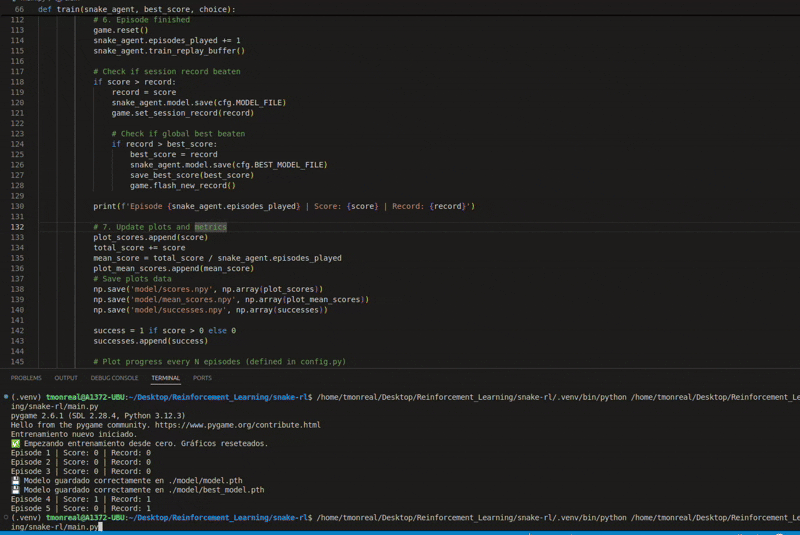

# Smart Snake Reinforcement Learning Agent

A Reinforcement Learning project that trains an AI agent to play a retro-styled Snake game using Deep Q-Learning (DQN).

---

## 🚀 Project Overview

This project trains a neural network to control a Snake agent:
- **State representation**: Danger in front, left, right + Snake direction + Apple position.
- **Action space**: [Straight, Right turn, Left turn]
- **Learning algorithm**: Deep Q-Learning (DQN)
- **Training features**:
  - Experience Replay buffer
  - Epsilon-greedy exploration strategy
  - Graphs showing learning progress

The project includes a simple **Pygame** visualizer for gameplay and a graphical menu to choose training mode.

---

## 📊 Results Tracking

- **Score vs Episode** plot
- **Success Rate** plot (moving average)
- **Automatic saving** of:
  - Best model (`best_model.pth`)
  - Current model (`model.pth`)
  - Best score (`best_score.txt`)
  - Training curves data (in `model/` folder)

---

## 🔹 Project Structure

```
smart-snake-rl/
├── agent.py          # SnakeAgent class (brain of the snake)
├── config.py         # All hyperparameters and constants
├── game.py           # SmartSnake environment (visual and logic)
├── main.py           # Entry point with training loop and menu
├── model.py          # DQN network and Trainer classes
├── utils.py          # Plotting utilities, save/load utilities
├── resources/        # Fonts and apple image
├── model/            # Folder for saving models and scores
├── plots/            # Saved training graphs
├── demos/            # Demo gifs and videos
├── README.md         # (this file)
├── requirements.txt  # Required libraries (if needed)
```

---

## ⚙️ Setup

### Requirements

- Python 3.10+
- Libraries:
  - torch
  - pygame
  - matplotlib
  - numpy

You can install them via pip:

```bash
pip install -r requirements.txt
```

---

## How to Run

```bash
python main.py
```

You will see a menu:
- "Start training from scratch"
- "Continue training best model"

Use your mouse to click and choose.

Training progress will be plotted every **20 episodes**. This can be modified by changing variable `PLOT_SAVE_EVERY` in `config.py`.

---

## 🎥 Demo

The following demos illustrate the evolution of the agent's performance:

**Episode 0 (early training):**



[Download Episode 0 (.webm)](demos/episode0.webm)

**Episode 100 (after training):**


[Download Episode 100 (.webm)](demos/episode100.webm)

---

## 💡 Future Improvements

- Add traps or moving obstacles.
- Implement Double DQN for better stability.
- Try Prioritized Experience Replay.
- Add bonuses: time-limited fruits for strategic play.
- Multi-agent snake competition!