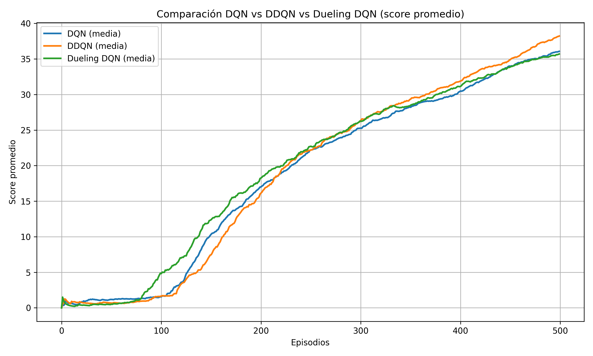
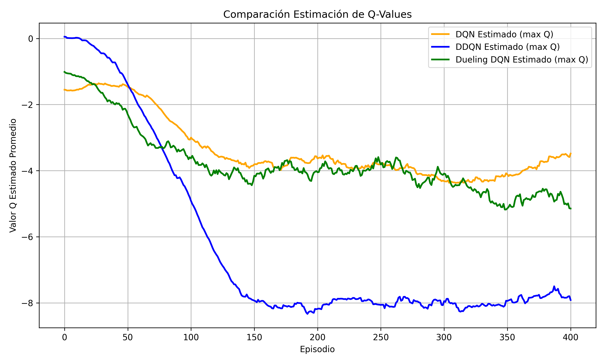

# 🐍 Smart Snake: Deep Reinforcement Learning Agent

A Reinforcement Learning project comparing three DQN-based agents trained to play a retro Snake game using Deep Q-Learning (DQN), Double DQN (DDQN), and Dueling DQN.

---

## 🚀 Project Overview

This project evaluates and compares the performance of:

- DQN – baseline Deep Q-Learning agent
- DDQN – Double DQN with target network decoupling
- Dueling DQN – separates state value and action advantage

All agents are tested in:
- A simple environment (single apple)
- A complex environment (red apple + time-limited golden apple)

The goal is to analyze and visualize the learning dynamics, stability, and final performance of each approach.

---

## ⚙️ Training Overview
- **State**: Danger `[front, left, right]`, current direction, red apple direction, (if enabled) golden apple direction.
- **Actions**: `[Straight, Right, Left]`
- **Reward Scheme**:
  - Red apple: +10
  - Golden apple (if enabled): +20
- **Collision**: -10
- **Timeout**: -3
- **Core features**:
  - Experience Replay
  - Epsilon-Greedy Exploration
  - Target Network (for DDQN)
  - Dueling Architecture (for Dueling DQN)
  - Custom Pygame visualizer
---
## 🧪 Running Experiments
You can train and compare any of the three agents in either environment:

```bash
# Train an agent in the simple environment
python main.py mode --env simple

# Train an agent in the hard environment (golden apple enabled)
python main.py mode --env golden
```

Replace `mode` with one of the following:
- `dqn`: Deep Q-Learning
- `ddqn`: Double DQN
- `dueling`: Dueling DQN

When you run the command, a graphical menu will appear allowing you to:
- Start training from scratch
- Continue training from best saved model

## 📂 Project Structure

```graphql
smart-snake/
├── main.py               # Main entry point: training loop + menu
├── game.py               # SmartSnake game environment (Pygame)
├── agent.py              # SnakeAgent (brain of the snake)
├── model.py              # DQN, DDQN, Dueling DQN trainers
├── config.py             # All hyperparameters
├── utils.py              # Plotting + file I/O
├── resources/            # Fonts + apple images
├── model/                # Saved models and training data
├── plots/                # Generated plots during training
├── demos/                # Demo GIFs and videos 
├── requirements.txt      # Python dependencies
└── README.md             # This file
```
---
## 📊 Logging & Visualizations
For each `(model, environment)` combination, the following are tracked:
- Episode scores
- Mean scores
- Success rates
- Estimated Q-values over time

Saved in:

```bash
model/results_dqn_simple/
model/results_dueling_golden/
...
```

And plots are saved in:

```bash
plots/dqn_simple/
plots/dueling_golden/
...
```

### 📈 Example Result Comparison (Hard environment)




---
## 🌟 Implementation Highlights
- All models use the same environment and training loop.
- Architecture is modular and supports switching agents via CLI.
- Each model is saved independently with its own metrics.
---
## Requirements

- Python 3.10+
- Libraries:
  - torch
  - pygame
  - matplotlib
  - numpy

You can install them via pip:

```bash
pip install -r requirements.txt
```

---

## 🎥 Demos

The following demos illustrate the behavior and learning progress of each agent in different stages of training and environments:


**Early episodes - All models:**

Initial performance is similarly random for all models.


[Download Early Episodes (.webm)](demos/dueling-episode0-golden.webm)

**DQN – Final Episodes (Simple & Golden Environments)**

- **Simple Environment – Episode 498**


[Download DQN Episode 498 Simple (.webm)](demos/dqn-episode490-simple.webm)

- **Golden Apple Environment – Episode 490**


[Download DQN Episode 490 Golden (.webm)](demos/dqn-episode490-golden.webm)

**DDQN – Intermediate Episodes (Golden Environment)**


[Download DDQN Episode 220 Golden (.webm)](demos/ddqn-episode220-golden.webm)

**Dueling DQN – Intermediate Episodes (Golden Environment)**


[Download Dueling DQN Episode 340 Golden (.webm)](demos/dueling-episode340-golden.webm)

---

## 💡 Future Improvements
- Add Prioritized Experience Replay
- Implement Soft Actor-Critic or PPO baseline
- Multi-agent training (competitive snake environment)
- Parameterized difficulty levels and level generator
- Leaderboard mode with human-vs-agent mode